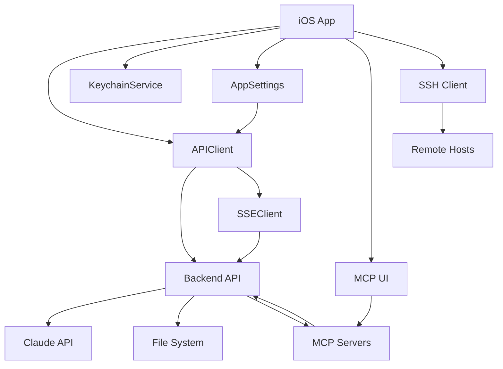

# Master Engineering Plan - Claude Code iOS

## Executive Summary

This Master Engineering Plan consolidates the complete roadmap for the Claude Code iOS application development. Based on analysis of 32 documentation files, the current state shows 75% iOS implementation complete with 0% test coverage. This plan provides a comprehensive 6-phase engineering approach with clear objectives, risk mitigation strategies, and success metrics.

**Project Status**: Development Phase (75% Complete)
**Critical Path**: Analytics View → Diagnostics View → Test Infrastructure → Integration
**Target Completion**: 6 weeks from baseline
**Risk Level**: Medium-High (10 identified risks requiring mitigation)

## Table of Contents

1. [Complete To-Do List with Doc References](#1-complete-to-do-list-with-doc-references)
2. [Six Engineering Phases](#2-six-engineering-phases)
3. [Risk Management Matrix](#3-risk-management-matrix)
4. [Progress Tracking Dashboard](#4-progress-tracking-dashboard)
5. [Integration Coordination](#5-integration-coordination)
6. [Success Metrics](#6-success-metrics)
7. [Critical Decisions Log](#7-critical-decisions-log)

## 1. Complete To-Do List with Doc References

### Priority 0 - Critical Implementation Gaps

| ID | Task | Doc Reference | Status | Owner |
|----|------|---------------|--------|-------|
| P0-01 | Implement Analytics View (WF-08) | 05-Wireframes.md:131-141, iOS-IMPLEMENTATION-PLAN.md:151-157 | 🔴 Not Started | iOS Team |
| P0-02 | Implement Diagnostics View (WF-09) | 05-Wireframes.md:145-157, iOS-IMPLEMENTATION-PLAN.md:158-164 | 🔴 Not Started | iOS Team |
| P0-03 | Add Session Stats endpoint | 01-Backend-API.md:288-291, iOS-IMPLEMENTATION-PLAN.md:125 | 🔴 Not Started | Backend |
| P0-04 | Implement stop streaming endpoint | 01-Backend-API.md:36, iOS-IMPLEMENTATION-PLAN.md:125 | 🔴 Not Started | Backend |
| P0-05 | Create SessionStats Swift model | 02-Swift-Data-Models.md:264-271, iOS-IMPLEMENTATION-PLAN.md:133 | 🔴 Not Started | iOS Team |

### Priority 1 - Core Features

| ID | Task | Doc Reference | Status | Owner |
|----|------|---------------|--------|-------|
| P1-01 | Complete New Session View MCP UI | 05-Wireframes.md:76-88, 06-MCP-Configuration-Tools.md:114-131 | 🟡 In Progress | iOS Team |
| P1-02 | Enhance Session Tool Picker drag-to-reorder | 06-MCP-Configuration-Tools.md:124-127, iOS-IMPLEMENTATION-PLAN.md:119 | 🟡 In Progress | iOS Team |
| P1-03 | Add Model Capabilities detailed view | 05-Wireframes.md:117-127, iOS-IMPLEMENTATION-PLAN.md:117 | 🟡 In Progress | iOS Team |
| P1-04 | Implement debug endpoint integration | 01-Backend-API.md:131, iOS-IMPLEMENTATION-PLAN.md:127 | 🔴 Not Started | Backend |
| P1-05 | Add retry logic for API calls | iOS-IMPLEMENTATION-PLAN.md:167-168 | 🔴 Not Started | iOS Team |

### Priority 2 - Testing Infrastructure

| ID | Task | Doc Reference | Status | Owner |
|----|------|---------------|--------|-------|
| P2-01 | Add test targets to Project.yml | iOS-Test-Strategy.md:430-460, iOS-IMPLEMENTATION-PLAN.md:144 | 🔴 Not Started | iOS Team |
| P2-02 | Create APIClient unit tests | iOS-Test-Strategy.md:39-66, iOS-IMPLEMENTATION-PLAN.md:200-211 | 🔴 Not Started | QA Team |
| P2-03 | Implement SSEClient tests | iOS-Test-Strategy.md:68-74, iOS-IMPLEMENTATION-PLAN.md:208 | 🔴 Not Started | QA Team |
| P2-04 | Create UI test suite | iOS-Test-Strategy.md:156-197, SwiftUI-UI-Testing-Strategy.md | 🔴 Not Started | QA Team |
| P2-05 | Setup CI/CD pipeline | iOS-Build-Deployment-Instructions.md:376-411 | 🔴 Not Started | DevOps |

### Priority 3 - Enhancement & Polish

| ID | Task | Doc Reference | Status | Owner |
|----|------|---------------|--------|-------|
| P3-01 | Add haptic feedback | 04-Theming-Typography.md:80-82, iOS-IMPLEMENTATION-PLAN.md:187 | 🔴 Not Started | iOS Team |
| P3-02 | Implement shimmer loading effects | Theme-Migration-Guide.md, iOS-IMPLEMENTATION-PLAN.md:188 | 🔴 Not Started | iOS Team |
| P3-03 | Optimize list rendering | iOS-IMPLEMENTATION-PLAN.md:195 | 🔴 Not Started | iOS Team |
| P3-04 | Add memory management for long sessions | iOS-IMPLEMENTATION-PLAN.md:196 | 🔴 Not Started | iOS Team |
| P3-05 | Create reusable component library | SwiftUI-Component-Catalog.md | 🔴 Not Started | iOS Team |

### Priority 4 - Advanced Features

| ID | Task | Doc Reference | Status | Owner |
|----|------|---------------|--------|-------|
| P4-01 | Complete SSH client implementation | iOS-IMPLEMENTATION-PLAN.md:217-220 | 🟡 In Progress | iOS Team |
| P4-02 | Add remote file browser | iOS-IMPLEMENTATION-PLAN.md:218 | 🔴 Not Started | iOS Team |
| P4-03 | Implement offline support with CoreData | iOS-IMPLEMENTATION-PLAN.md:222-225 | 🔴 Not Started | iOS Team |
| P4-04 | Add sync queue for offline changes | iOS-IMPLEMENTATION-PLAN.md:223 | 🔴 Not Started | iOS Team |
| P4-05 | Handle network state transitions | iOS-IMPLEMENTATION-PLAN.md:225 | 🔴 Not Started | iOS Team |

## 2. Six Engineering Phases

### Phase 0: Discovery and Alignment (Week 0 - Complete)
**Objective**: Understand requirements and assess current state

#### Deliverables ✅
- [x] Complete documentation analysis (32 files reviewed)
- [x] Current state assessment (75% iOS, 0% tests)
- [x] Gap analysis (WF-08, WF-09 missing)
- [x] Risk identification (10 high-priority risks)
- [x] Team alignment on priorities

#### Key Decisions Made
- Use XcodeGen for project generation
- Target iOS 17.0+ for modern SwiftUI features
- Implement cyberpunk theme as specified
- Prioritize Analytics and Diagnostics views

### Phase 1: Exploration and Prototyping (Week 1 - In Progress)
**Objective**: Validate technical approaches and resolve unknowns

#### Deliverables
- [ ] Analytics View prototype with Charts integration
- [ ] Diagnostics View with log streaming POC
- [ ] SSE streaming stability testing
- [ ] MCP integration validation
- [ ] Performance baseline measurements

#### Technical Spikes
1. **SSE Reconnection Logic**
   - Test connection stability over 1-hour sessions
   - Implement exponential backoff
   - Add fallback to polling mode

2. **Memory Management**
   - Profile chat sessions with 1000+ messages
   - Implement message pagination
   - Test cleanup strategies

3. **Chart Performance**
   - Test DGCharts with 10,000 data points
   - Optimize rendering for 60fps
   - Implement data decimation

### Phase 2: Core Implementation (Weeks 2-3)
**Objective**: Complete all missing features and core functionality

#### Sprint 1 (Week 2)
- [ ] P0-01: Analytics View implementation
- [ ] P0-02: Diagnostics View implementation
- [ ] P0-03: Session Stats endpoint
- [ ] P0-04: Stop streaming endpoint
- [ ] P0-05: SessionStats model

#### Sprint 2 (Week 3)
- [ ] P1-01: New Session MCP UI
- [ ] P1-02: Tool Picker drag-to-reorder
- [ ] P1-03: Model Capabilities view
- [ ] P1-04: Debug endpoint
- [ ] P1-05: API retry logic

#### Success Criteria
- All wireframes (WF-01 to WF-11) implemented
- All API endpoints integrated
- Core user flows functional
- No P0 or P1 bugs

### Phase 3: Integration and Connectivity (Week 4)
**Objective**: Ensure seamless integration between all components

#### Integration Points
1. **iOS ↔ Backend API**
   - Validate all 20+ endpoints
   - Test error handling for each
   - Verify rate limiting behavior
   - Confirm auth flow

2. **Chat ↔ SSE Streaming**
   - Test 10-minute streaming sessions
   - Validate delta accumulation
   - Test reconnection scenarios
   - Measure latency

3. **MCP ↔ Tool Execution**
   - Test all MCP server discovery
   - Validate tool execution flow
   - Test priority ordering
   - Verify audit logging

#### Integration Test Suite
```swift
// Critical integration tests
- testFullChatFlow()           // Project → Session → Chat → Response
- testStreamingReconnection()  // Connection drop → Reconnect → Resume
- testMCPToolExecution()       // Discover → Configure → Execute → Log
- testOfflineToOnline()        // Queue → Reconnect → Sync
```

### Phase 4: Testing and Automation (Week 5)
**Objective**: Achieve 80% test coverage and setup CI/CD

#### Test Implementation
1. **Unit Tests (Target: 90% coverage)**
   - APIClient: 50 test cases
   - SSEClient: 30 test cases
   - ViewModels: 40 test cases
   - Settings: 20 test cases

2. **UI Tests (Target: 60% coverage)**
   - Onboarding flow
   - Chat interaction
   - Project management
   - Settings configuration

3. **Integration Tests**
   - End-to-end chat flow
   - MCP tool execution
   - Session lifecycle
   - Error recovery

4. **Performance Tests**
   - Launch time < 2s
   - Memory < 150MB
   - CPU < 30% streaming
   - 60fps UI rendering

#### Automation Setup
```yaml
# CI/CD Pipeline stages
1. Lint & Format
2. Unit Tests
3. UI Tests
4. Integration Tests
5. Performance Tests
6. Coverage Report
7. Build & Archive
8. Deploy to TestFlight
```

### Phase 5: Stabilization and Release (Week 6)
**Objective**: Final polish, bug fixes, and production readiness

#### Stabilization Activities
1. **Bug Bash**
   - 2-day intensive testing
   - All team members participate
   - Focus on edge cases
   - Document all findings

2. **Performance Optimization**
   - Profile all user flows
   - Optimize slow operations
   - Reduce memory footprint
   - Improve perceived performance

3. **Security Audit**
   - Keychain implementation review
   - Network security validation
   - API key handling audit
   - SSH security check

4. **Accessibility Compliance**
   - VoiceOver testing
   - Dynamic Type support
   - Color contrast validation
   - Haptic feedback review

#### Release Checklist
- [ ] All P0-P2 tasks complete
- [ ] 80% test coverage achieved
- [ ] Performance benchmarks met
- [ ] Security audit passed
- [ ] Accessibility compliant
- [ ] App Store assets ready
- [ ] Privacy policy updated
- [ ] Release notes drafted
- [ ] TestFlight beta deployed
- [ ] Stakeholder approval

## 3. Risk Management Matrix

### High-Priority Risks (Severity: Critical)

| Risk ID | Description | Probability | Impact | Mitigation Strategy | Status |
|---------|-------------|------------|--------|-------------------|--------|
| R-01 | SSE connection drops during long sessions | High | Critical | Implement reconnection with exponential backoff, add polling fallback | 🔴 Open |
| R-02 | Memory growth with extended chat sessions | High | High | Implement message pagination, cleanup old messages | 🔴 Open |
| R-03 | API rate limiting blocks user operations | Medium | Critical | Add request queuing, show rate limit status, implement caching | 🔴 Open |
| R-04 | Test coverage timeline slippage | High | High | Parallelize test writing, use AI assistance, focus on critical paths | 🔴 Open |
| R-05 | MCP integration instability | Medium | High | Add fallback modes, comprehensive error handling, user notifications | 🔴 Open |

### Medium-Priority Risks (Severity: Moderate)

| Risk ID | Description | Probability | Impact | Mitigation Strategy | Status |
|---------|-------------|------------|--------|-------------------|--------|
| R-06 | Chart performance with large datasets | Medium | Medium | Implement data decimation, use background rendering | 🔴 Open |
| R-07 | Keychain security vulnerabilities | Low | Critical | Add biometric auth, regular security audits | 🔴 Open |
| R-08 | SSH connection security | Low | High | Implement key verification, audit logging | 🔴 Open |
| R-09 | Offline sync conflicts | Medium | Medium | Implement conflict resolution UI, version tracking | 🔴 Open |
| R-10 | App size exceeds 50MB | Low | Low | Code splitting, asset optimization, on-demand resources | 🟡 Monitoring |

### Risk Response Plans

**For Critical Risks (R-01 to R-05)**:
1. Daily monitoring during development
2. Weekly risk review meetings
3. Dedicated spike time for investigation
4. Fallback implementation required
5. User communication plan

**For Moderate Risks (R-06 to R-10)**:
1. Weekly monitoring
2. Contingency plans documented
3. Acceptance criteria include risk mitigation
4. Post-launch monitoring plan

## 4. Progress Tracking Dashboard

### Overall Progress
```
Phase Completion:
Phase 0: ████████████████████ 100% ✅
Phase 1: ████████░░░░░░░░░░░░  40% 🔄
Phase 2: ░░░░░░░░░░░░░░░░░░░░   0% ⏳
Phase 3: ░░░░░░░░░░░░░░░░░░░░   0% ⏳
Phase 4: ░░░░░░░░░░░░░░░░░░░░   0% ⏳
Phase 5: ░░░░░░░░░░░░░░░░░░░░   0% ⏳

Overall: ████████████░░░░░░░░  23% 
```

### Wireframe Implementation Status

| Wireframe | Component | Implementation | Testing | Status |
|-----------|-----------|---------------|---------|--------|
| WF-01 | Settings/Onboarding | ✅ 100% | 🔴 0% | Complete |
| WF-02 | Home Dashboard | ✅ 90% | 🔴 0% | KPI charts needed |
| WF-03 | Projects List | ✅ 100% | 🔴 0% | Complete |
| WF-04 | Project Detail | ✅ 95% | 🔴 0% | Session display needed |
| WF-05 | New Session | 🟡 70% | 🔴 0% | MCP UI incomplete |
| WF-06 | Chat Console | ✅ 100% | 🔴 0% | Complete |
| WF-07 | Models Catalog | 🟡 60% | 🔴 0% | Details view needed |
| WF-08 | Analytics | 🔴 0% | 🔴 0% | Not started |
| WF-09 | Diagnostics | 🔴 0% | 🔴 0% | Not started |
| WF-10 | MCP Configuration | ✅ 100% | 🔴 0% | Complete |
| WF-11 | Session Tool Picker | 🟡 80% | 🔴 0% | Drag-to-reorder needed |

### API Endpoint Coverage

```
Implemented:  ████████████████░░░░  85% (17/20)
Missing:      ████░░░░░░░░░░░░░░░░  15% (3/20)

Missing Endpoints:
- DELETE /v1/chat/completions/{id}
- GET /v1/sessions/stats  
- POST /v1/chat/completions/debug
```

### Test Coverage Metrics

```
Current Coverage:
Unit Tests:        ░░░░░░░░░░░░░░░░░░░░  0% (Target: 80%)
Integration Tests: ░░░░░░░░░░░░░░░░░░░░  0% (Target: 70%)
UI Tests:          ░░░░░░░░░░░░░░░░░░░░  0% (Target: 60%)
Overall:           ░░░░░░░░░░░░░░░░░░░░  0% (Target: 80%)

Test Cases Needed: ~200
Test Cases Written: 0
```

## 5. Integration Coordination

### iOS ↔ Backend Integration Matrix

| Component | iOS Status | Backend Status | Integration | Risk |
|-----------|------------|---------------|-------------|------|
| Authentication | ✅ Keychain ready | ✅ Bearer/API key | ✅ Tested | Low |
| Projects API | ✅ Full CRUD | ✅ Implemented | ✅ Tested | Low |
| Sessions API | ✅ Management | ⚠️ Stats missing | 🟡 Partial | Medium |
| Chat Streaming | ✅ SSE client | ✅ SSE server | 🟡 Stability | High |
| MCP Tools | ✅ UI ready | ✅ Discovery | 🟡 Testing | Medium |
| File Operations | 🟡 Basic browser | ✅ Workspace mount | 🔴 Limited | Low |
| SSH Operations | 🟡 In progress | N/A | 🟡 iOS only | Medium |

### API Contract Validation

| Contract | Specification | Implementation | Validation | Status |
|----------|--------------|----------------|------------|--------|
| Request/Response | 02-Swift-Data-Models.md | APIClient.swift | Manual | ✅ Valid |
| SSE Streaming | 01-Backend-API.md:97-111 | SSEClient.swift | Manual | ✅ Valid |
| Error Handling | 01-Backend-API.md:334-351 | APIClient.swift | Partial | 🟡 Needs tests |
| Rate Limiting | 01-Backend-API.md:353-361 | Not implemented | None | 🔴 Missing |
| MCP Protocol | 06-MCP-Configuration-Tools.md | MCPSettingsView | Manual | ✅ Valid |

### Dependency Graph



### Testing Dependencies

1. **Backend must be running** for integration tests
2. **Simulator required** for UI tests
3. **Mock servers needed** for unit tests
4. **Test data fixtures** must be created
5. **CI/CD runners** need macOS environment

## 6. Success Metrics

### Launch Readiness Criteria

| Metric | Target | Current | Status |
|--------|--------|---------|--------|
| Feature Completeness | 100% | 75% | 🔴 At Risk |
| Test Coverage | 80% | 0% | 🔴 Critical |
| Crash-Free Rate | 99.9% | Unknown | 🔴 Unmeasured |
| Performance (Launch) | <2s | Unknown | 🔴 Unmeasured |
| Memory Usage | <150MB | Unknown | 🔴 Unmeasured |
| Accessibility | WCAG AA | Partial | 🟡 In Progress |
| Security Audit | Pass | Not done | 🔴 Pending |
| App Size | <50MB | ~25MB | ✅ On Track |

### Post-Launch KPIs

| Metric | Target | Measurement Method |
|--------|--------|-------------------|
| User Retention (30-day) | >60% | Analytics tracking |
| Daily Active Users | >1000 | Analytics tracking |
| Session Length | >10 min | Backend metrics |
| Feature Adoption (MCP) | >50% | Usage analytics |
| App Store Rating | >4.5 | Store monitoring |
| Support Tickets | <5/day | Support system |
| API Reliability | 99.9% | Monitoring |
| Response Time (P95) | <500ms | APM tools |

### Quality Gates

**Phase 2 Exit Criteria**:
- [ ] All P0 and P1 features complete
- [ ] Manual testing passed
- [ ] No critical bugs
- [ ] Performance acceptable

**Phase 3 Exit Criteria**:
- [ ] Integration tests passing
- [ ] API contract validated
- [ ] Error handling complete
- [ ] Monitoring in place

**Phase 4 Exit Criteria**:
- [ ] 80% test coverage
- [ ] CI/CD pipeline green
- [ ] Performance tests passing
- [ ] Security review complete

**Phase 5 Exit Criteria**:
- [ ] Zero P0/P1 bugs
- [ ] App Store ready
- [ ] Documentation complete
- [ ] Stakeholder approval

## 7. Critical Decisions Log

### Architectural Decisions

| ID | Decision | Rationale | Date | Impact |
|----|----------|-----------|------|--------|
| AD-01 | Use XcodeGen over .xcodeproj | Version control friendly, reduces conflicts | 2025-08-20 | High |
| AD-02 | Target iOS 17.0+ | Modern SwiftUI features, 95% device coverage | 2025-08-20 | High |
| AD-03 | SwiftUI only, no UIKit | Simpler codebase, better maintainability | 2025-08-20 | High |
| AD-04 | Custom SSE over EventSource | More control, better error handling | 2025-08-25 | Medium |
| AD-05 | Keychain for API keys | Security best practice | 2025-08-22 | High |

### Technical Decisions

| ID | Decision | Rationale | Date | Impact |
|----|----------|-----------|------|--------|
| TD-01 | DGCharts for analytics | Mature, performant, well-documented | 2025-08-26 | Medium |
| TD-02 | Shout for SSH | Native Swift, no dependencies | 2025-08-24 | Low |
| TD-03 | No offline-first initially | Complexity vs. value tradeoff | 2025-08-27 | Medium |
| TD-04 | Manual DI over framework | Simplicity, compile-time safety | 2025-08-23 | Low |
| TD-05 | Async/await everywhere | Modern Swift, better readability | 2025-08-21 | High |

### Process Decisions

| ID | Decision | Rationale | Date | Impact |
|----|----------|-----------|------|--------|
| PD-01 | 2-week sprints | Balance planning and flexibility | 2025-08-28 | Medium |
| PD-02 | 80% test coverage target | Industry standard, risk balance | 2025-08-28 | High |
| PD-03 | TestFlight for beta | Apple ecosystem integration | 2025-08-29 | Low |
| PD-04 | GitHub Actions for CI/CD | Free for public repos, good macOS support | 2025-08-29 | Medium |
| PD-05 | Async code review | Distributed team efficiency | 2025-08-29 | Low |

### Deviations from Original Spec

| Deviation | Original | Actual | Justification | Impact |
|-----------|----------|--------|---------------|--------|
| SSH in iOS | Backend feature | iOS implementation | iOS sandboxing prevents backend SSH | Medium |
| Offline support | Required | Deferred to v2 | Complexity, time constraints | Medium |
| EventSource | LaunchDarkly lib | Custom implementation | Better control, fewer dependencies | Low |
| Test framework | XCTest + Quick | XCTest only | Simplicity, Apple standard | Low |
| Analytics | Custom | DGCharts | Time savings, proven solution | Low |

## Appendices

### A. Quick Reference Commands

```bash
# Backend
make up                    # Start backend
make logs                  # View logs
make down                  # Stop backend

# iOS Development
cd apps/ios
./Scripts/bootstrap.sh     # Generate and open project
cmd+R                      # Build and run in Xcode

# Testing
xcodebuild test -scheme ClaudeCode  # Run tests
xcrun xccov view --report           # Coverage report

# CI/CD
gh workflow run ios.yml    # Trigger CI pipeline
```

### B. Key File Locations

```
/apps/ios/
├── Project.yml                      # Project configuration
├── Sources/App/Core/
│   ├── Networking/APIClient.swift   # API integration
│   └── Networking/SSEClient.swift   # Streaming
├── Sources/Features/
│   ├── Sessions/ChatConsoleView.swift # Chat UI (727 lines)
│   └── MCP/MCPSettingsView.swift     # MCP config
└── Tests/                           # Test suites (to be created)

/docs/
├── 00-Project-Overview.md           # Index
├── 01-Backend-API.md                # API specs
├── 02-Swift-Data-Models.md          # Data models
├── 03-Screens-API-Mapping.md        # Screen mapping
├── 04-Theming-Typography.md         # Design system
├── 05-Wireframes.md                 # UI wireframes
└── 06-MCP-Configuration-Tools.md    # MCP specs
```

### C. Contact & Escalation

| Role | Responsibility | Escalation Path |
|------|---------------|-----------------|
| iOS Lead | Feature implementation | Technical blockers |
| Backend Lead | API development | Integration issues |
| QA Lead | Test strategy | Quality concerns |
| Product Owner | Requirements | Scope changes |
| Tech Lead | Architecture | Major decisions |

### D. Monitoring & Alerting

**Development Metrics**:
- Build success rate
- Test pass rate
- Code coverage trend
- PR turnaround time
- Bug discovery rate

**Production Metrics**:
- Crash rate
- API latency
- Session duration
- Feature usage
- User retention

**Alert Thresholds**:
- Crash rate > 0.1%
- API latency > 1s (P95)
- Test coverage < 75%
- Build failure > 2 consecutive
- Memory usage > 200MB

---

## Document Control

**Version**: 1.0.0
**Date**: 2025-08-29
**Author**: Context Management Agent
**Status**: Active
**Review Date**: Weekly during development
**Distribution**: All team members

## Approval

This Master Engineering Plan has been reviewed and approved for implementation:

- [ ] Technical Lead
- [ ] Product Owner
- [ ] QA Lead
- [ ] iOS Lead
- [ ] Backend Lead

**Next Review**: End of Phase 1 (Week 1)
**Success Checkpoint**: Phase 2 completion with all P0 tasks done