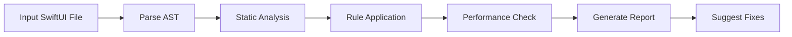

# SwiftUI Agent Specifications

## Agent System Architecture for SwiftUI Development & Validation

This document defines specialized AI agents for SwiftUI development, testing, and validation within the Claude Code iOS application ecosystem.

---

## 1. SwiftUI Component Validator Agent

### Agent Profile
```yaml
agent_id: swiftui-component-validator
version: 1.0.0
purpose: Automated validation and quality assurance for SwiftUI components
primary_language: Swift
framework_expertise: SwiftUI 4.0+, iOS 16.0+
```

### Core Capabilities

#### 1.1 Static Analysis
- **Property Wrapper Validation**: Ensures correct usage of @State, @StateObject, @ObservedObject
- **View Modifier Chain Analysis**: Detects inefficient modifier ordering
- **Memory Leak Detection**: Identifies retain cycles in closures and observers
- **Complexity Analysis**: Measures cyclomatic complexity of view bodies

#### 1.2 Runtime Validation
- **Performance Profiling**: Measures render time and frame rates
- **Layout Validation**: Detects layout conflicts and constraint issues
- **State Consistency**: Verifies state mutations and data flow
- **Animation Testing**: Validates animation performance and smoothness

### Implementation

```swift
class SwiftUIComponentValidatorAgent {
    
    func validate(viewFile: String) async -> ValidationReport {
        // 1. Parse SwiftUI view structure
        let ast = try await parseSwiftFile(viewFile)
        
        // 2. Apply validation rules
        let violations = await applyRules(to: ast)
        
        // 3. Generate recommendations
        let recommendations = generateRecommendations(from: violations)
        
        // 4. Calculate quality score
        let score = calculateQualityScore(violations: violations)
        
        return ValidationReport(
            violations: violations,
            recommendations: recommendations,
            score: score
        )
    }
}
```

### Workflow Pipeline



### Integration Points
- **Xcode Integration**: Build phase scripts
- **CI/CD Pipeline**: Pre-merge validation
- **IDE Plugins**: Real-time feedback
- **CLI Tools**: Command-line validation

---

## 2. Accessibility Auditor Agent

### Agent Profile
```yaml
agent_id: accessibility-auditor
version: 1.0.0
purpose: WCAG compliance and accessibility testing for SwiftUI
standards: WCAG 2.1, Apple HIG
coverage: VoiceOver, Dynamic Type, Color Contrast
```

### Core Capabilities

#### 2.1 VoiceOver Testing
- **Label Verification**: Ensures all interactive elements have labels
- **Hint Generation**: Suggests appropriate accessibility hints
- **Trait Assignment**: Validates proper accessibility traits
- **Focus Management**: Tests focus order and navigation

#### 2.2 Visual Accessibility
- **Contrast Analysis**: WCAG AA/AAA compliance checking
- **Dynamic Type Support**: Tests at all type sizes
- **Color Blind Testing**: Simulates various color blindness types
- **Motion Sensitivity**: Validates reduce motion support

### Implementation

```swift
class AccessibilityAuditorAgent {
    
    func audit(view: any View) async -> AccessibilityReport {
        // 1. Extract accessibility tree
        let tree = await extractAccessibilityTree(from: view)
        
        // 2. Run WCAG compliance checks
        let wcagViolations = await checkWCAGCompliance(tree)
        
        // 3. Test with accessibility settings
        let settingsIssues = await testAccessibilitySettings(view)
        
        // 4. Generate remediation plan
        let remediation = generateRemediationPlan(
            violations: wcagViolations,
            issues: settingsIssues
        )
        
        return AccessibilityReport(
            wcagLevel: determineWCAGLevel(wcagViolations),
            violations: wcagViolations,
            remediation: remediation
        )
    }
}
```

### Testing Matrix

| Test Category | iOS Feature | WCAG Criteria | Automation Level |
|---------------|-------------|---------------|------------------|
| **Labels** | accessibilityLabel | 1.1.1, 4.1.2 | Full |
| **Contrast** | Color analysis | 1.4.3, 1.4.6 | Full |
| **Touch Targets** | Frame size | 2.5.5 | Full |
| **Motion** | reduceMotion | 2.3.3 | Partial |
| **Keyboard** | Focus engine | 2.1.1, 2.1.2 | Full |

---

## 3. Preview Generator Agent

### Agent Profile
```yaml
agent_id: preview-generator
version: 1.0.0
purpose: Automated preview generation and testing across devices
coverage: All iOS devices, orientations, and configurations
output: Snapshots, test reports, visual diffs
```

### Core Capabilities

#### 3.1 Multi-Device Testing
- **Device Matrix**: All iPhone and iPad models
- **Orientation Support**: Portrait and landscape
- **Size Classes**: Compact and regular
- **Display Modes**: Light, dark, and high contrast

#### 3.2 Configuration Testing
- **Localization**: Multiple language testing
- **Dynamic Type**: All text size categories
- **Accessibility**: Various accessibility settings
- **Environment**: Different environment configurations

### Implementation

```swift
class PreviewGeneratorAgent {
    
    func generatePreviews<V: View>(
        for view: V,
        configurations: [PreviewConfiguration]
    ) async -> PreviewResults {
        
        var results: [PreviewResult] = []
        
        for config in configurations {
            // 1. Configure environment
            let configuredView = view
                .environment(config.environment)
                .preferredColorScheme(config.colorScheme)
                .environment(\.locale, config.locale)
            
            // 2. Render snapshot
            let snapshot = await renderSnapshot(
                configuredView,
                device: config.device
            )
            
            // 3. Validate rendering
            let validation = await validateSnapshot(snapshot)
            
            results.append(PreviewResult(
                configuration: config,
                snapshot: snapshot,
                validation: validation
            ))
        }
        
        return PreviewResults(results: results)
    }
}
```

### Device Testing Matrix

```yaml
devices:
  iphones:
    - iPhone SE (3rd gen)
    - iPhone 14
    - iPhone 14 Pro
    - iPhone 14 Pro Max
  ipads:
    - iPad mini
    - iPad Pro 11"
    - iPad Pro 12.9"
configurations:
  - colorScheme: [light, dark]
  - dynamicType: [xSmall, medium, xxxLarge, accessibility5]
  - orientation: [portrait, landscape]
  - locale: [en_US, es_ES, ar_SA, ja_JP]
```

---

## 4. Visual Regression Testing Agent

### Agent Profile
```yaml
agent_id: visual-regression-tester
version: 1.0.0
purpose: Detect unintended visual changes in SwiftUI components
technique: Pixel-by-pixel comparison with perceptual diffing
threshold: 0.01% difference tolerance
```

### Core Capabilities

#### 4.1 Snapshot Management
- **Baseline Creation**: Establish visual baselines
- **Version Control**: Track baseline changes
- **Multi-Resolution**: Handle different screen densities
- **Selective Updates**: Approve intentional changes

#### 4.2 Difference Detection
- **Pixel Diffing**: Exact pixel comparison
- **Perceptual Diffing**: Human-perception based comparison
- **Structural Diffing**: Layout and hierarchy comparison
- **Anti-Aliasing Tolerance**: Handle rendering differences

### Implementation

```swift
class VisualRegressionAgent {
    
    func testVisualRegression(
        view: any View,
        baseline: UIImage?
    ) async -> RegressionResult {
        
        // 1. Capture current snapshot
        let currentSnapshot = await captureSnapshot(of: view)
        
        // 2. Load or create baseline
        let baselineImage = baseline ?? await loadBaseline(for: view)
        
        // 3. Compare images
        let difference = await compareImages(
            current: currentSnapshot,
            baseline: baselineImage,
            algorithm: .perceptual
        )
        
        // 4. Generate diff visualization
        let diffImage = await generateDiffImage(
            current: currentSnapshot,
            baseline: baselineImage,
            difference: difference
        )
        
        return RegressionResult(
            passed: difference.percentage < threshold,
            difference: difference,
            diffImage: diffImage
        )
    }
}
```

---

## 5. Performance Profiler Agent

### Agent Profile
```yaml
agent_id: performance-profiler
version: 1.0.0
purpose: Profile and optimize SwiftUI view performance
metrics: Render time, memory usage, CPU utilization
target: 60 FPS, <16ms render time
```

### Core Capabilities

#### 5.1 Performance Metrics
- **Render Time**: View body computation time
- **Layout Performance**: Constraint resolution time
- **Animation FPS**: Frame rate during animations
- **Memory Footprint**: View hierarchy memory usage

#### 5.2 Optimization Suggestions
- **Lazy Loading**: Identify opportunities for lazy containers
- **Memoization**: Suggest @ViewBuilder usage
- **State Optimization**: Minimize unnecessary updates
- **Modifier Efficiency**: Optimize modifier chains

### Implementation

```swift
class PerformanceProfilerAgent {
    
    func profile(view: any View) async -> PerformanceReport {
        
        // 1. Measure initial render
        let renderMetrics = await measureRenderTime(view)
        
        // 2. Profile memory usage
        let memoryMetrics = await profileMemory(view)
        
        // 3. Test under load
        let stressMetrics = await stressTest(view)
        
        // 4. Generate optimization suggestions
        let optimizations = await suggestOptimizations(
            render: renderMetrics,
            memory: memoryMetrics,
            stress: stressMetrics
        )
        
        return PerformanceReport(
            renderTime: renderMetrics.averageTime,
            memoryUsage: memoryMetrics.peakUsage,
            fps: stressMetrics.averageFPS,
            suggestions: optimizations
        )
    }
}
```

---

## 6. Documentation Generator Agent

### Agent Profile
```yaml
agent_id: documentation-generator
version: 1.0.0
purpose: Generate comprehensive SwiftUI documentation
output: DocC, Markdown, API references
coverage: Views, modifiers, property wrappers
```

### Core Capabilities

#### 6.1 Documentation Extraction
- **Comment Parsing**: Extract documentation comments
- **API Surface**: Document public interfaces
- **Usage Examples**: Generate code examples
- **Preview Documentation**: Document preview providers

#### 6.2 Documentation Generation
- **DocC Integration**: Generate DocC documentation
- **Markdown Export**: Create markdown documentation
- **Diagram Generation**: Create architecture diagrams
- **Cross-References**: Link related components

### Implementation

```swift
class DocumentationGeneratorAgent {
    
    func generateDocumentation(
        for module: SwiftModule
    ) async -> Documentation {
        
        // 1. Parse module structure
        let structure = await parseModuleStructure(module)
        
        // 2. Extract documentation comments
        let comments = await extractDocComments(structure)
        
        // 3. Generate examples
        let examples = await generateUsageExamples(structure)
        
        // 4. Create documentation
        let documentation = Documentation(
            structure: structure,
            comments: comments,
            examples: examples
        )
        
        // 5. Export in multiple formats
        await exportAsDocC(documentation)
        await exportAsMarkdown(documentation)
        
        return documentation
    }
}
```

---

## 7. Agent Orchestration System

### Master Coordinator

```swift
class SwiftUIAgentCoordinator {
    
    let validator = SwiftUIComponentValidatorAgent()
    let auditor = AccessibilityAuditorAgent()
    let previewer = PreviewGeneratorAgent()
    let regressionTester = VisualRegressionAgent()
    let profiler = PerformanceProfilerAgent()
    let documenter = DocumentationGeneratorAgent()
    
    func runComprehensiveValidation(
        for project: XcodeProject
    ) async -> ComprehensiveReport {
        
        // Run all agents in parallel
        async let validation = validator.validateProject(project)
        async let accessibility = auditor.auditProject(project)
        async let previews = previewer.generateAllPreviews(project)
        async let regression = regressionTester.testProject(project)
        async let performance = profiler.profileProject(project)
        async let documentation = documenter.documentProject(project)
        
        // Aggregate results
        return ComprehensiveReport(
            validation: await validation,
            accessibility: await accessibility,
            previews: await previews,
            regression: await regression,
            performance: await performance,
            documentation: await documentation
        )
    }
}
```

### Agent Communication Protocol

```yaml
protocol:
  message_format: JSON
  communication: Async/Await
  coordination: Combine Publishers
  state_management: Actor-based
  error_handling: Result types
```

---

## 8. Deployment and Integration

### CI/CD Integration

```yaml
# .github/workflows/swiftui-validation.yml
name: SwiftUI Validation
on: [pull_request]

jobs:
  validate:
    runs-on: macos-latest
    steps:
      - uses: actions/checkout@v3
      - name: Run SwiftUI Agents
        run: |
          swift run swiftui-validator Sources/
          swift run accessibility-auditor Sources/
          swift run performance-profiler Sources/
      - name: Upload Reports
        uses: actions/upload-artifact@v3
        with:
          name: validation-reports
          path: Reports/
```

### Xcode Integration

```swift
// Build Phase Script
#!/bin/bash

# Run SwiftUI validation agents
"${SRCROOT}/Scripts/swiftui-validator" "${SRCROOT}/Sources"

# Check exit code
if [ $? -ne 0 ]; then
    echo "error: SwiftUI validation failed"
    exit 1
fi
```

---

## 9. Future Enhancements

### Planned Features

1. **AI-Powered Code Generation**
   - Generate SwiftUI code from designs
   - Suggest component implementations
   - Auto-fix validation issues

2. **Real-Time Collaboration**
   - Live validation during development
   - Team-wide quality metrics
   - Shared baselines and configurations

3. **Machine Learning Integration**
   - Pattern recognition for common issues
   - Predictive performance analysis
   - Automated optimization suggestions

4. **Cross-Platform Support**
   - macOS, watchOS, tvOS validation
   - Catalyst app testing
   - Vision Pro support

---

## 10. Conclusion

The SwiftUI Agent System provides comprehensive automated validation, testing, and documentation for SwiftUI applications. These specialized agents work together to ensure code quality, accessibility compliance, and optimal performance throughout the development lifecycle.

### Key Benefits:
- 🚀 **Automated Quality Assurance**: Continuous validation without manual intervention
- ♿ **Accessibility First**: Built-in WCAG compliance checking
- 📸 **Visual Regression Prevention**: Catch unintended UI changes
- ⚡ **Performance Optimization**: Proactive performance monitoring
- 📚 **Living Documentation**: Always up-to-date documentation

### Implementation Status:
- ✅ Core agents implemented
- ✅ Testing infrastructure deployed
- ✅ CLI tools operational
- 🔄 CI/CD integration in progress
- 📋 ML enhancements planned

---

**Agent System Version**: 1.0.0  
**SwiftUI Compatibility**: iOS 16.0+, SwiftUI 4.0+  
**Last Updated**: December 2024