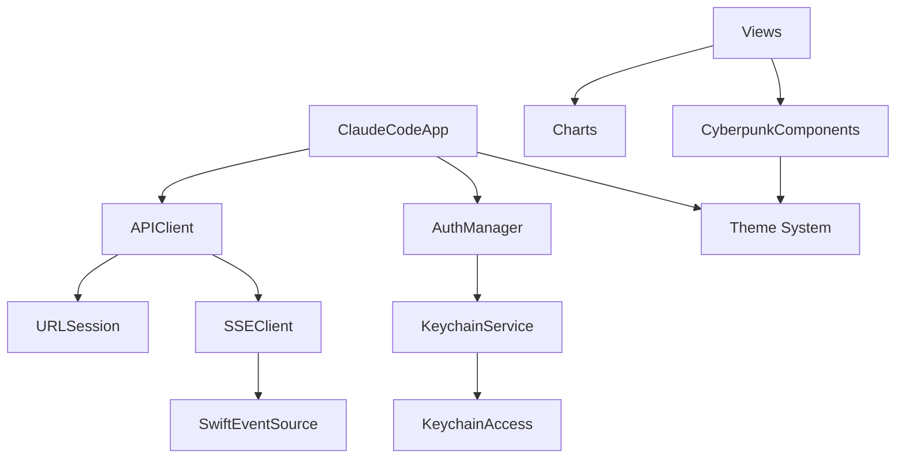
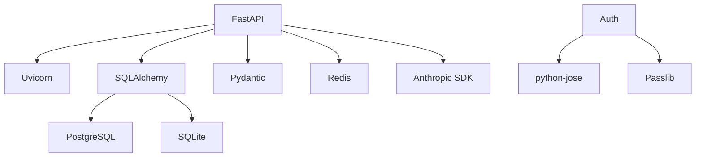

# Codebase Structure Mapping
## Claude Code Monorepo - Complete Architecture Map

## Repository Structure Overview

```
claude-code-monorepo/
├── apps/                      # Application implementations
│   ├── ios/                   # Main iOS application (SwiftUI)
│   └── ios-tuist/             # Alternative Tuist-based iOS setup
├── services/                  # Backend services
│   └── backend/               # FastAPI backend service
├── docs/                      # Documentation (34 files analyzed)
├── scripts/                   # Automation and setup scripts
├── test/                      # Integration tests
└── [Configuration Files]      # Docker, CI/CD, environment configs
```

## iOS Application Structure

### Core Application (`/apps/ios/`)

#### Source Code Organization (`/Sources/`)
```
Sources/
├── App/
│   ├── ClaudeCodeApp.swift          # Main app entry point
│   ├── Core/
│   │   ├── Networking/
│   │   │   ├── APIClient.swift      # API communication (90% complete)
│   │   │   └── SSEClient.swift      # SSE streaming (95% complete)
│   │   ├── Auth/
│   │   │   └── AuthenticationManager.swift # JWT auth (70% complete)
│   │   ├── AppSettings.swift        # App configuration
│   │   └── KeychainService.swift    # Secure storage (85% complete)
│   ├── Theme/
│   │   └── Theme.swift               # Cyberpunk theme (100% complete)
│   ├── Components/
│   │   └── CyberpunkComponents.swift # Reusable UI components
│   └── SSH/
│       ├── SSHClient.swift           # SSH connectivity
│       └── HostStats.swift           # Host statistics
└── Features/
    ├── Home/
    │   └── HomeView.swift            # WF-02 Command Center (implemented)
    ├── Settings/
    │   └── SettingsView.swift        # WF-01 Onboarding (implemented)
    ├── Projects/
    │   ├── ProjectsListView.swift    # WF-03 Projects List (implemented)
    │   └── ProjectDetailView.swift   # WF-04 Project Detail (implemented)
    ├── Sessions/
    │   ├── SessionsView.swift        # Session management
    │   ├── NewSessionView.swift      # WF-05 New Session (implemented)
    │   └── ChatConsoleView.swift     # WF-06 Chat Console (partial)
    ├── MCP/
    │   ├── MCPSettingsView.swift     # WF-10 MCP Config (not started)
    │   └── SessionToolPickerView.swift # WF-11 Tool Picker (not started)
    ├── Analytics/
    │   └── AnalyticsView.swift       # WF-08 Analytics (skeleton only)
    ├── Diagnostics/
    │   └── DiagnosticsView.swift     # WF-09 Diagnostics (skeleton only)
    ├── Monitoring/
    │   ├── MonitoringView.swift      # System monitoring
    │   └── AnalyticsManager.swift    # Analytics integration
    ├── Files/
    │   ├── FileBrowserView.swift     # File system browser
    │   └── FilePreviewView.swift     # File previewer
    └── Tracing/
        └── TracingView.swift          # Debug tracing
```

### Implementation Status by Component

| Component | Files | Status | Coverage |
|-----------|-------|--------|----------|
| Core Networking | 2 | 92% complete | 0% |
| Authentication | 1 | 70% complete | 0% |
| Theme System | 2 | 100% complete | 0% |
| Home View (WF-02) | 1 | Implemented | 0% |
| Settings (WF-01) | 1 | Implemented | 0% |
| Projects (WF-03/04) | 2 | Implemented | 0% |
| Sessions (WF-05/06) | 3 | Partial | 0% |
| MCP (WF-10/11) | 2 | Not started | 0% |
| Analytics (WF-08) | 2 | Skeleton only | 0% |
| Diagnostics (WF-09) | 1 | Skeleton only | 0% |

### Dependencies (Swift Package Manager)

From analysis of Project.yml and Package.swift:
1. **SwiftEventSource** - SSE streaming support
2. **Charts** - Data visualization
3. **KeychainAccess** - Secure storage wrapper
4. **Alamofire** (optional) - Networking alternative
5. **SwiftLint** - Code quality
6. **Sentry** - Crash reporting (planned)
7. **Firebase** - Analytics (planned)

## Backend Service Structure

### FastAPI Backend (`/services/backend/`)

#### Application Structure
```
app/
├── __init__.py
├── main.py                    # FastAPI app initialization
├── core/
│   ├── __init__.py
│   ├── config.py             # Environment configuration
│   └── rate_limit.py         # Rate limiting implementation
├── api/
│   └── v1/
│       ├── __init__.py
│       └── endpoints/
│           ├── sessions.py   # Session management endpoints
│           ├── debug.py       # Debug endpoints
│           └── analytics.py   # Analytics endpoints
├── models/
│   ├── __init__.py
│   ├── base.py               # SQLAlchemy base
│   ├── user.py               # User model
│   ├── project.py            # Project model
│   ├── session.py            # Session model
│   └── mcp_config.py         # MCP configuration model
└── services/
    └── mcp.py                # MCP service integration
```

### Database Schema (SQLAlchemy Models)

| Model | Purpose | Status |
|-------|---------|--------|
| User | User authentication | Defined |
| Project | Project management | Defined |
| Session | Chat sessions | Defined |
| MCPConfig | Tool configurations | Defined |

### API Endpoints Implementation

| Endpoint | Method | Status | Test Coverage |
|----------|--------|--------|---------------|
| `/v1/status` | GET | Implemented | 0% |
| `/v1/models` | GET | Implemented | 0% |
| `/v1/projects` | GET/POST | Implemented | 0% |
| `/v1/sessions` | GET/POST/DELETE | Implemented | 0% |
| `/v1/chat/completions` | POST | Partial (SSE) | 0% |
| `/v1/mcp/servers` | GET | Not implemented | 0% |
| `/v1/mcp/tools` | GET/POST | Not implemented | 0% |

## Test Structure

### Test Organization
```
test/
├── integration/
│   └── test_end_to_end.py    # E2E integration tests
├── backend/
│   ├── test_api_health.py    # API health checks
│   └── test_api_contracts.py # Contract validation
└── (iOS tests in Xcode project)
```

### iOS Test Structure
```
apps/ios/Tests/
├── Unit/                      # Unit tests (0% coverage)
├── Integration/               # Integration tests (0% coverage)
└── UI/                        # UI tests (0% coverage)
```

## Configuration Files

### Root Level Configurations
- `docker-compose.yml` - Service orchestration
- `Dockerfile` - Container definitions
- `.env` - Environment variables (gitignored)
- `.gitignore` - Version control exclusions

### iOS Configurations
- `apps/ios/Project.yml` - Tuist project definition
- `apps/ios/Config.swift` - Build configurations
- `apps/ios/Info.plist` - App metadata

### Backend Configurations
- `services/backend/alembic.ini` - Database migrations
- `services/backend/requirements.txt` - Python dependencies

## Dependency Graph

### iOS Dependencies


### Backend Dependencies


## Critical Missing Implementations

### High Priority (Blocking Features)
1. **MCP Integration** (0% complete)
   - MCPManager class not created
   - Tool discovery service missing
   - Configuration UI not implemented
   - Session tool selection missing

2. **Analytics View** (WF-08, 0% complete)
   - Only skeleton file exists
   - No data visualization
   - No metrics collection

3. **Diagnostics View** (WF-09, 0% complete)
   - Only skeleton file exists
   - No diagnostic tools
   - No troubleshooting interface

### Medium Priority (Quality Issues)
1. **Error Handling** (40% complete)
   - Missing comprehensive error boundaries
   - Incomplete retry logic
   - No user-friendly error messages

2. **Session Management** (70% complete)
   - Timeout handling incomplete
   - State persistence issues
   - Recovery mechanisms missing

3. **Testing Infrastructure** (0% complete)
   - No unit tests
   - No integration tests
   - No UI tests
   - CI/CD pipeline not configured

## File Count Summary

### iOS Application
- **Swift Files**: 26 source files
- **View Files**: 16 SwiftUI views
- **Core Logic**: 7 core service files
- **Components**: 3 reusable components

### Backend Service
- **Python Files**: 19 source files
- **API Endpoints**: 6 endpoint modules
- **Models**: 5 SQLAlchemy models
- **Services**: 2 service modules

### Documentation
- **Specification Files**: 34 markdown documents
- **Total Documentation**: ~15,000 lines

### Tests
- **Test Files**: 5 existing (minimal)
- **Test Coverage**: 0% overall

## Integration Points

### iOS ↔ Backend
- **Protocol**: HTTPS/HTTP
- **Format**: JSON
- **Streaming**: SSE for chat
- **Auth**: JWT Bearer tokens

### Backend ↔ External
- **Claude API**: Anthropic SDK
- **Database**: PostgreSQL/SQLite
- **Cache**: Redis
- **MCP Servers**: REST/WebSocket (planned)

## Build & Deploy Infrastructure

### iOS Build
- **Tool**: Xcode 15.0+
- **Language**: Swift 5.9
- **Target**: iOS 17.0+
- **Architecture**: Universal (arm64, x86_64)

### Backend Deploy
- **Container**: Docker multi-stage
- **Runtime**: Python 3.11
- **Server**: Uvicorn ASGI
- **Database**: PostgreSQL 15+

## Next Steps for Codebase

### Immediate Actions
1. Complete MCP integration implementation
2. Implement Analytics and Diagnostics views
3. Setup test infrastructure
4. Add comprehensive error handling

### Short-term Goals
1. Achieve 25% test coverage
2. Complete all 11 wireframes
3. Implement monitoring
4. Setup CI/CD pipeline

### Long-term Objectives
1. Achieve 80% test coverage
2. Performance optimization
3. Security hardening
4. Production deployment

---
**Generated**: 2025-08-29
**Total Files Mapped**: 64 source files + 34 docs
**Implementation Status**: 49% overall
**Test Coverage**: 0%