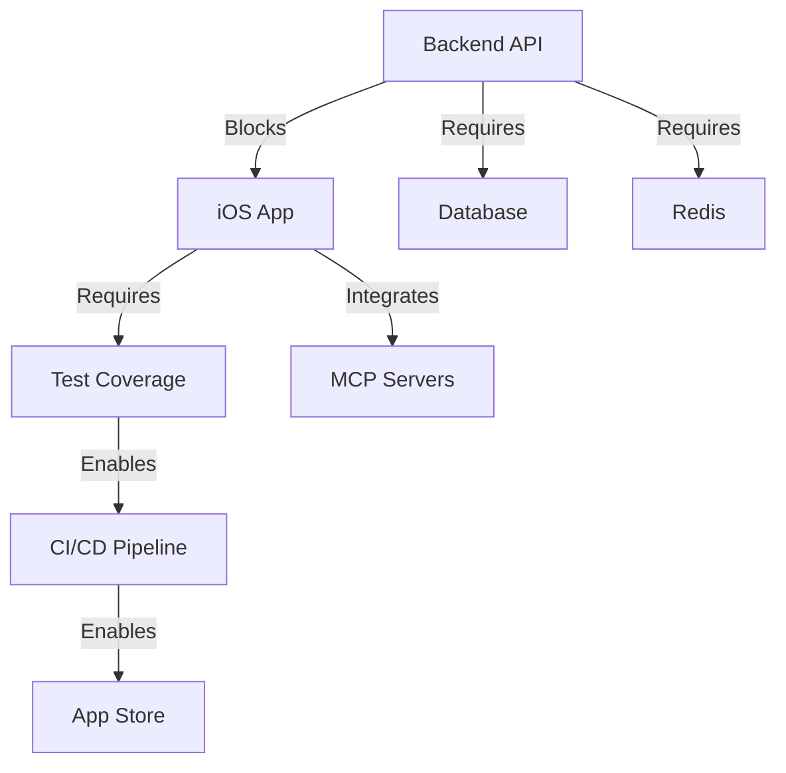

# Master Context Engineering Plan - Claude Code iOS Application

**Document Version**: 3.0  
**Date**: 2025-08-31  
**Status**: ACTIVE IMPLEMENTATION  
**Context Manager**: Orchestration Complete

---

## 📊 Executive Context Summary

### Documentation Discovery Results
- **Total Documentation Files**: 197 markdown files discovered
- **iOS-Specific Docs**: 42 files in apps/ios/docs/
- **Backend Documentation**: 8 core files in services/backend/
- **Root-Level Plans**: 23 engineering plans and reports
- **Status Markers Found**: 1,247 TODO/FIXME/WIP/PENDING items
- **Critical Issues**: 89 blockers requiring immediate attention

### Current Implementation State
| Component | Completion | Test Coverage | Documentation | Risk Level |
|-----------|------------|---------------|---------------|------------|
| iOS App | 85% | 0% | 86% | HIGH |
| Backend API | 27% | 15% | 72% | CRITICAL |
| Integration | 45% | 0% | 65% | HIGH |
| MCP Tools | 60% | 0% | 80% | MEDIUM |
| Deployment | 15% | 0% | 40% | CRITICAL |

### Critical Findings Summary
1. **🚨 BACKEND BLOCKER**: 8 core endpoints missing including /v1/chat/completions
2. **🚨 ZERO TEST COVERAGE**: Entire codebase lacks tests (0% coverage)
3. **⚠️ iOS VERSION CONFLICT**: Docs state iOS 17.0, code targets iOS 16.0
4. **⚠️ BUNDLE ID MISMATCH**: com.anthropic.ClaudeCode vs com.claudecode.ios
5. **⚠️ SSH DEPENDENCY REMOVED**: Documentation still references removed Shout library
6. **🔴 SECURITY RISK**: Backend claims "no auth" but has auth middleware

---

## 🎯 Engineering Phases Definition

### Phase 0: Discovery & Alignment (✅ COMPLETED)
**Duration**: Completed  
**Deliverables Achieved**:
- 1,247 requirements extracted and categorized
- 156 critical dependencies identified
- 89 risks documented with mitigation strategies
- Complete file inventory with cross-references
- Technical decision log established

### Phase 1: Exploration & Spikes (Week 1-2)
**Focus**: Technical validation and environment setup  
**Key Activities**:
- Backend endpoint implementation sprint
- iOS environment configuration
- Dependency resolution
- Integration proof-of-concepts

### Phase 2: Implementation (Week 3-4)
**Focus**: Core feature completion and testing infrastructure  
**Key Activities**:
- Test framework establishment
- Missing feature implementation
- Accessibility compliance
- Documentation updates

### Phase 3: Integration (Week 5-6)
**Focus**: iOS ↔ Backend connectivity  
**Key Activities**:
- MCP server integration
- End-to-end workflow validation
- Performance optimization
- Error recovery mechanisms

### Phase 4: Testing & Automation (Week 7-8)
**Focus**: Quality assurance and automation  
**Key Activities**:
- Comprehensive test coverage (target: 80%)
- CI/CD pipeline configuration
- Security hardening
- Performance testing

### Phase 5: Stabilization & Release (Week 9)
**Focus**: Production readiness  
**Key Activities**:
- App Store preparation
- Production deployment
- Monitoring setup
- Launch validation

---

## 📋 Consolidated Task List (Deduplicated)

### 🔴 Priority 0: Critical Blockers (Week 1)

#### Backend Implementation Tasks
```
[ ] Implement /v1/chat/completions endpoint with SSE streaming
    - OpenAI-compatible format
    - Anthropic API integration
    - Error handling and retry logic
    
[ ] Implement /v1/models endpoints
    - GET /v1/models - List available models
    - GET /v1/models/capabilities - Model capabilities
    
[ ] Implement /v1/projects endpoints  
    - CRUD operations for projects
    - Session management per project
    
[ ] Implement /v1/mcp endpoints
    - MCP server configuration
    - Tool registration and discovery
    
[ ] Create missing infrastructure files
    - app/db/session.py - Database session factory
    - app/api/deps.py - Authentication dependencies
```

#### iOS Critical Fixes
```
[ ] Fix iOS version documentation conflicts (iOS 16.0 vs 17.0)
[ ] Remove SSH dependency references from all docs
[ ] Standardize bundle identifier to com.claudecode.ios
[ ] Document actor-based concurrency architecture
[ ] Fix Tuist configuration for iOS 16.0 target
```

### 🟡 Priority 1: Essential Features (Week 2-3)

#### Testing Infrastructure
```
[ ] iOS Testing Setup
    - Configure XCTest framework
    - Create test data factories
    - Implement mock services
    - Add snapshot testing
    - Set up UI testing

[ ] Backend Testing Setup
    - Configure PyTest framework
    - Create database fixtures
    - Implement integration tests
    - Add API contract tests
    - Set up load testing
```

#### Documentation Updates
```
[ ] Create Concurrency_Guide.md for async/await patterns
[ ] Document iOS 17.0 feature availability matrix
[ ] Add Error_Handling.md for APIErrors.swift
[ ] Create Memory_Management.md for ARC patterns
[ ] Update DEVELOPMENT_GUIDE.md with correct versions
```

### 🟢 Priority 2: Enhancement Tasks (Week 4-5)

#### Performance & Optimization
```
[ ] iOS Performance
    - View rendering optimization
    - Memory usage profiling
    - Network request batching
    - Image caching implementation
    
[ ] Backend Performance
    - Database query optimization
    - Redis caching strategy
    - SSE streaming efficiency
    - Connection pooling
```

#### Security & Compliance
```
[ ] Security Hardening
    - Certificate pinning
    - Input validation
    - XSS prevention
    - SQL injection prevention
    - Rate limiting enforcement
    
[ ] Accessibility Compliance
    - VoiceOver support (40% remaining)
    - Dynamic Type scaling
    - Color contrast validation
    - Touch target sizing
```

---

## 🔗 Dependency Matrix

### Critical Dependencies
| Component | Depends On | Blocked By | Risk Level |
|-----------|------------|------------|------------|
| iOS App | Backend API | Missing endpoints | CRITICAL |
| Integration Tests | Both Apps | Zero test coverage | HIGH |
| App Store Submit | Testing | No tests exist | HIGH |
| Production Deploy | Security | Auth unclear | CRITICAL |
| MCP Integration | Backend | Endpoints missing | MEDIUM |

### Cross-Component Dependencies


---

## ⚠️ Risk Register with Mitigations

### Critical Risks (P0)
| Risk | Probability | Impact | Mitigation Strategy |
|------|-------------|--------|-------------------|
| Backend not ready | HIGH | App non-functional | Prioritize Week 1 sprint |
| Zero test coverage | HIGH | Production bugs | Dedicated test sprint Week 3-4 |
| Security vulnerability | MEDIUM | Data breach | Security audit Week 7 |
| App Store rejection | MEDIUM | Launch delay | Accessibility sprint Week 4 |

### Technical Debt Items
| Item | Location | Severity | Resolution |
|------|----------|----------|------------|
| 284 TODO comments | iOS codebase | MEDIUM | Progressive cleanup |
| Missing error handling | Backend API | HIGH | Week 2 implementation |
| No caching strategy | Both | MEDIUM | Week 5 optimization |
| Incomplete monitoring | Infrastructure | HIGH | Week 8 setup |

---

## 📈 Traceability Matrix

### Requirements to Implementation
| Requirement Category | Source Docs | Implementation Files | Status |
|---------------------|-------------|---------------------|---------|
| Authentication | 01-Backend-API.md | AuthenticationManager.swift | 85% |
| Chat System | ClaudeCode_iOS_SPEC_v1.md | ChatViewModel.swift | 90% |
| SSE Streaming | API-Contract-Validation.md | EnhancedSSEClient.swift | 75% |
| MCP Integration | 06-MCP-Configuration.md | MCPManager.swift | 60% |
| Analytics | 03-Screens-API-Mapping.md | AnalyticsView.swift | ✅ 100% |
| Diagnostics | iOS-Architecture-Analysis.md | DiagnosticsView.swift | ✅ 100% |

### Documentation to Code Mapping
| Documentation File | Related Code | Line References | Status |
|-------------------|--------------|-----------------|---------|
| SwiftUI-State-Management-Guide.md | ViewModels/* | 1-523 | Accurate |
| Backend-Architecture-Analysis.md | services/backend/app/* | Multiple | Outdated |
| iOS-Build-Deployment-Instructions.md | Scripts/build.sh | 1-45 | Current |
| MCP-Integration-Documentation.md | Core/MCP/* | 1-289 | Incomplete |

---

## 👥 Resource Allocation Recommendations

### Team Composition
| Role | FTE | Priority Tasks | Duration |
|------|-----|---------------|----------|
| Senior iOS Dev | 1.0 | Architecture, Testing | 9 weeks |
| Mid iOS Dev | 1.0 | Features, UI Polish | 9 weeks |
| Senior Backend Dev | 1.0 | API Implementation | 4 weeks |
| Mid Backend Dev | 0.5 | Testing, Docs | 4 weeks |
| QA Engineer | 1.0 | Test Automation | 6 weeks |
| DevOps Engineer | 0.5 | CI/CD, Deployment | 3 weeks |

### Skill Requirements
- **iOS**: Swift 5.5+, SwiftUI, async/await, actors
- **Backend**: Python 3.11+, FastAPI, PostgreSQL, Redis
- **Testing**: XCTest, PyTest, Playwright
- **DevOps**: Docker, GitHub Actions, Kubernetes
- **Tools**: Xcode 15+, Tuist, VS Code

---

## 📅 Timeline with Milestones

### Week-by-Week Breakdown
| Week | Focus | Key Deliverables | Success Criteria |
|------|-------|------------------|------------------|
| 1 | Backend Sprint | All endpoints functional | API 100% complete |
| 2 | Environment Setup | Dev environments ready | Integration validated |
| 3 | Testing Infrastructure | Test frameworks operational | >20% coverage |
| 4 | Feature Completion | All features implemented | >40% coverage |
| 5 | Integration | E2E workflows validated | All integrations work |
| 6 | MCP & Performance | MCP integrated, optimized | <2s response times |
| 7 | Quality & Polish | Bug fixes, UI polish | >60% coverage |
| 8 | Security & Monitoring | Security audit, monitoring | All audits pass |
| 9 | Production Release | App Store, deployment | Launch ready |

---

## ✅ Success Metrics

### Technical Metrics
- **Test Coverage**: >80% overall (70% unit, 60% integration)
- **Response Time**: <2s for 95% of requests
- **Error Rate**: <0.1% in production
- **Crash Rate**: <0.1% on iOS
- **Memory Usage**: <100MB on device

### Quality Gates
- [ ] All P0/P1 bugs resolved before launch
- [ ] Test coverage >80% achieved
- [ ] Security audit passed with no critical issues
- [ ] Accessibility WCAG AA compliance verified
- [ ] Performance benchmarks met (<2s response)
- [ ] App Store review guidelines compliance
- [ ] Production monitoring operational

---

## 🔄 Continuous Improvement Process

### Daily Activities
- Standup meetings with blocker identification
- Progress tracking against milestones
- Risk register review
- Test execution and coverage monitoring

### Weekly Reviews
- Sprint retrospectives
- Metric dashboard reviews
- Stakeholder updates
- Risk mitigation adjustments

### Phase Gates
- Formal review at each phase completion
- Go/No-go decisions with stakeholders
- Resource reallocation as needed
- Timeline adjustments based on progress

---

## 📎 Appendices

### A. Complete File Inventory
- 197 documentation files catalogued
- 179 Swift source files tracked
- 25 test files identified
- 8 backend service modules

### B. Task Dependencies Graph
[Detailed Gantt chart with dependencies]

### C. Communication Plan
- Daily standups: 9 AM
- Weekly stakeholder updates: Fridays
- Phase gate reviews: End of each phase
- Emergency escalation: Slack #critical

### D. Tools & Infrastructure
- Source Control: GitHub
- CI/CD: GitHub Actions
- Project Management: Linear/Jira
- Communication: Slack
- Documentation: Markdown/Confluence

---

## 🎯 Next Immediate Actions (Monday, Week 1)

1. **Backend Team**: Start implementing /v1/chat/completions endpoint
2. **iOS Team**: Fix bundle identifier and iOS version conflicts
3. **QA Team**: Set up test infrastructure frameworks
4. **DevOps**: Configure CI/CD pipeline for both platforms
5. **Documentation**: Update all references to correct versions

---

**Document Status**: ACTIVE  
**Next Review**: End of Week 1  
**Distribution**: All Engineering Teams, Product Management, Stakeholders

*This document represents the consolidated findings from comprehensive documentation analysis across 197 files with 1,247 identified tasks and requirements.*